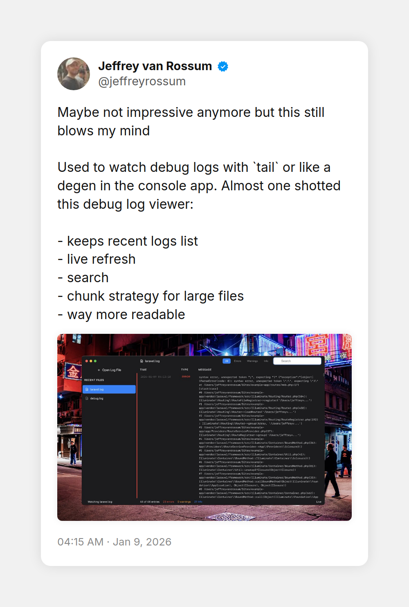

# 🐛 LogSifter

A minimalist log viewer for macOS inspired by Apple Console.

## Features

- 📂 Open and view log files
- 🔄 Live file watching — automatically updates when the log file changes
- 🔍 Search and filter log entries
- 🌗 Light and dark mode support
- 🏛️ Recent files list for quick access
- 📋 Easy copy/paste for AI assisted debugging

## ⚠️ Disclaimer

This app was almost entirely "vibe coded" with AI assistance. **Use at your own risk.** While it works for basic log viewing, there may be bugs or unexpected behavior.

## Origin story



## Contributing

Contributions are welcome! Feel free to open issues or submit pull requests.

## Running Locally

### Prerequisites

- [Node.js](https://nodejs.org/) (v18 or higher recommended)
- npm

### Setup

1. Clone the repository:
   ```bash
   git clone https://github.com/jeffreyvr/log-sifter.git
   cd log-sifter
   ```

2. Install dependencies:
   ```bash
   npm install
   ```

3. Run in development mode:
   ```bash
   npm run dev
   ```

   This will start the app with live CSS rebuilding.

### Available Scripts

| Command | Description |
|---------|-------------|
| `npm run dev` | Start in development mode with hot reload |
| `npm start` | Build CSS and start the app |
| `npm run build:css` | Build Tailwind CSS |
| `npm run dist` | Build distributable for current platform |
| `npm run dist:mac` | Build macOS DMG |

## License

MIT
